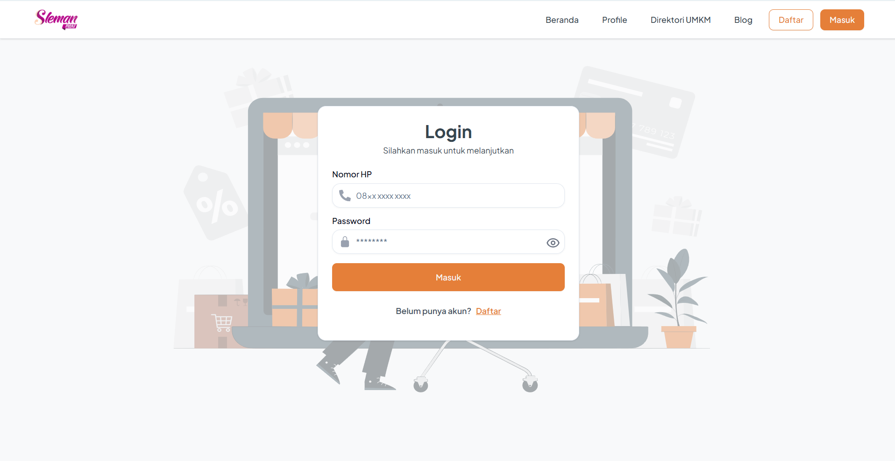

# Sleman Mart 🛍️

Sleman Mart adalah platform marketplace digital yang memungkinkan pengguna untuk berbelanja kebutuhan sehari-hari secara online.

## 📸 Screenshots


*Homepage login*

<!-- 
*Halaman daftar produk dengan filter kategori*


*Keranjang belanja dengan kalkulasi otomatis* -->

## 🚀 Tech Stack

- **Framework:** Next.js 15.4.5
- **Language:** TypeScript
- **Styling:** 
  - Tailwind CSS
  - Shadcn UI (Radix UI + Class Variance Authority)
- **State Management:** TanStack Query v5
- **Form Handling:** React Hook Form + Zod validation
- **UI/UX:**
  - Framer Motion
  - Embla Carousel
  - Sonner (Toast notifications)

## 🛠️ Prerequisites

- Node.js 18+ 
- npm/yarn/pnpm
- Git

## ⚡ Quick Start

1. **Clone Repository**
```bash
git clone https://github.com/yourusername/sleman-mart.git
cd sleman-mart
```

2. **Install Dependencies**
```bash
pnpm install
```

3. **Setup Environment**
```bash
cp .env.example .env.local
```

4. **Start Development Server**
```bash
pnpm run dev
```

5. **Build for Production**
```bash
pnpm run build
pnpm start
```

## 💡 Key Features

### Form Validation
```typescript
const schema = z.object({
  email: z.string().email('Email tidak valid'),
  password: z.string().min(6, 'Password minimal 6 karakter')
})

const form = useForm({
  resolver: zodResolver(schema)
})
```

### Data Fetching
```typescript
const { data, isLoading } = useQuery({
  queryKey: ['products'],
  queryFn: async () => {
    const res = await fetch('/api/products')
    return res.json()
  }
})
```

### Styled Components
```typescript
import { Button } from "@/components/ui/button"

export function ProductCard() {
  return (
    <Button variant="outline" size="lg">
      Add to Cart
    </Button>
  )
}
```

## 📁 Project Structure

```
sleman-mart/
├── app/
│   ├── (auth)/         # Authentication routes
│   ├── (main)/         # Shop pages
│   └── layout.tsx      # Root layout
├── components/
│   ├── ui/             # Reusable UI components
│   ├── forms/          # Form components
│   └── product/           # Shop specific components
├── lib/                # Utilities & configurations
├── public/             # Static assets
└── types/              # TypeScript definitions
```

## 🔧 Environment Variables

```env
NEXT_PUBLIC_BACKEND_API_URL="https://host.backend/api"
NEXT_PUBLIC_APP_URL=http://localhost:3000
```

## 📝 License

This project is licensed under the MIT License - see the [LICENSE](LICENSE) file for details.


## Developer Team

- [Masga Satria Wirawan](https://github.com/mxsgx)
- [Heru Kristanto](https://github.com/NicoIzumi30)
- [Kadek Riyan Kusuma Putra](https://github.com/kadekriyan)
- [Rahmat Suhadi](https://github.com/rahmatsuhadi)


Project
